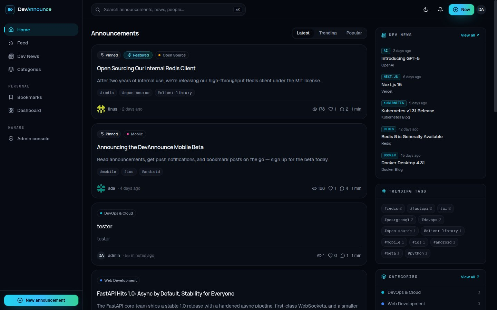
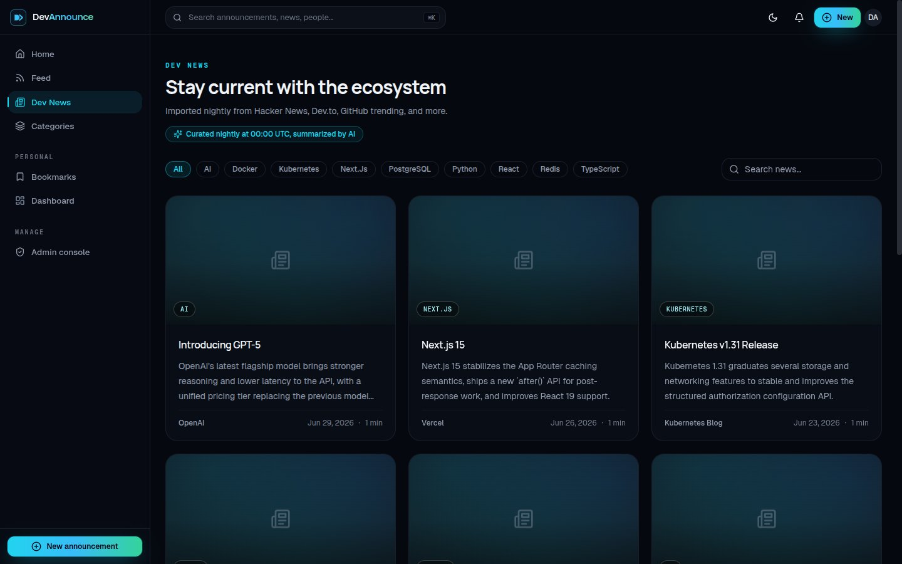

<div align="center">

# 📣 DevAnnounce

**A modern announcement & developer news platform.**

Publish announcements, upload documents, share links, and discover the latest developer & AI news — with the polish of Linear, the community of Dev.to, and the speed of Vercel.



</div>

---

## ✨ Features

- **Announcements** — Markdown content, tags, categories, thumbnails, attachments, CTA buttons, GitHub/website/demo links, drafts, scheduled publishing, pin & feature.
- **Dev News** — automated daily import (midnight UTC) from RSS feeds, news APIs & GitHub trending across 15 developer topics, with optional **AI summarization by Claude** (bring your own Anthropic API key, set from the Admin portal).
- **Community** — likes, bookmarks, threaded comments, follows, user profiles.
- **Real-time notifications** — WebSocket-powered: likes, comments, follows, admin announcements, fresh news.
- **Search** — PostgreSQL full-text search across titles, content, tags, categories & authors.
- **Dashboards** — user analytics (views, likes, downloads, weekly/monthly charts) and a full admin console (stats, moderation queue, user bans, category management, system logs, storage overview).
- **File uploads** — up to 25 MB per file (images, PDF, Office docs, ZIP, Markdown, TXT) stored in MinIO/S3.
- **Auth** — JWT access + refresh tokens (httpOnly cookies), email verification, password reset, bcrypt hashing, rate limiting.
- **UI** — dark mode by default, light mode included, responsive, Framer Motion animations, shadcn/ui components.

## 🚀 Quick Start

The only requirement is **Docker** (with Compose v2).

```bash
cd devannounce
./run.sh
```

That's it. The script checks dependencies, generates a `.env` with fresh secrets, builds all images, starts **PostgreSQL, Redis, MinIO, FastAPI, Next.js and Nginx**, runs database migrations, seeds demo data and creates the admin account.

| What | Where |
|---|---|
| App | http://localhost:8080 |
| API docs (Swagger UI) | http://localhost:8080/api/v1/docs |
| Admin login | `admin@devannounce.com` / `password123` |
| Demo user | `ada@devannounce.com` / `password123` |

Other commands: `./run.sh logs`, `./run.sh down`, `./run.sh restart`, `./run.sh status`, `./run.sh reset` (wipes data).

> Change the port by editing `APP_PORT` in `.env` and re-running `./run.sh`.

## 🔑 Enabling AI news summaries

Dev News works out of the box using RSS descriptions. For AI-written summaries:

1. Log in as admin → **Admin → Settings**.
2. Paste your **Anthropic API key** (`ANTHROPIC_API_KEY`).
3. Optionally add a [newsapi.org](https://newsapi.org) key (`NEWS_API_KEY`) for an extra news source.
4. Trigger an import immediately from **Admin → News → Fetch now**, or wait for the nightly job (00:00 UTC).

Keys are stored server-side and always displayed masked.

## 🏗 Architecture

```
                        ┌─────────────────────────────┐
   Browser ──────────▶  │  Nginx  :8080               │
                        │  ├── /            Next.js   │──▶ frontend:3000  (SSR + React 19)
                        │  ├── /api         FastAPI   │──▶ backend:8000   (REST + WebSockets)
                        │  └── /storage     MinIO     │──▶ minio:9000     (object storage)
                        └─────────────────────────────┘
                                     │
                 ┌───────────────────┼──────────────────┐
                 ▼                   ▼                  ▼
           PostgreSQL 16         Redis 7          APScheduler
           (data + FTS)     (cache, rate-limit,   (daily news import,
                             sessions, queues)     AI summarization)
```

- **Frontend** — Next.js 15 (App Router, standalone output), React 19, TypeScript, TailwindCSS, shadcn/ui, TanStack Query, React Hook Form + Zod, Framer Motion.
- **Backend** — FastAPI, SQLAlchemy 2 (async), Alembic migrations, Pydantic v2, JWT auth, APScheduler.
- **Data** — PostgreSQL (with `tsvector` full-text search), Redis, MinIO (S3-compatible; point the same env vars at AWS S3 in production).

The REST API is versioned under `/api/v1` — the full endpoint reference lives in [`docs/API_CONTRACT.md`](docs/API_CONTRACT.md) and interactively at `/api/v1/docs`.

## 📁 Folder Structure

```
devannounce/
├── backend/            FastAPI application
│   ├── app/
│   │   ├── api/v1/     Routers (auth, announcements, news, admin, ws…)
│   │   ├── core/       Config, database, security, redis, rate limiting
│   │   ├── models/     SQLAlchemy models
│   │   ├── schemas/    Pydantic schemas
│   │   ├── services/   Storage, email, news fetcher, AI summarizer
│   │   ├── scheduler.py  APScheduler jobs
│   │   └── seed.py     Demo data + admin account
│   ├── alembic/        Migrations
│   └── tests/          pytest suite
├── frontend/           Next.js 15 application
│   └── src/
│       ├── app/        Routes (landing, feeds, dashboard, admin…)
│       ├── components/ UI kit + feature components
│       ├── hooks/      Client hooks
│       └── lib/        API client, types, auth context
├── nginx/              Reverse proxy config
├── docs/               Architecture & API docs
├── scripts/            Utility scripts
├── docker-compose.yml
└── run.sh              One-command launcher
```

## ⚙️ Environment Variables

All configuration lives in `.env` (created from `.env.example` on first run):

| Variable | Default | Description |
|---|---|---|
| `APP_PORT` | `8080` | Public port served by Nginx |
| `POSTGRES_USER/PASSWORD/DB` | `devannounce` / generated / `devannounce` | Database credentials |
| `JWT_SECRET` | generated | Signing key for all tokens |
| `MINIO_ROOT_USER/PASSWORD` | `devannounce` / generated | Object storage credentials |
| `MINIO_BUCKET` | `devannounce` | Bucket for uploads |
| `ENVIRONMENT` | `production` | `production` or `development` |
| `SEED_DEMO_DATA` | `true` | Seed demo users/posts/news on first start |

API keys for news fetching (Anthropic, NewsAPI) are **not** env vars — they are managed at runtime from **Admin → Settings**.

## 🧪 Development

```bash
# Backend tests (from backend/)
pip install -r requirements.txt && pytest

# Backend lint/format
ruff check app tests && black --check app tests

# Frontend (from frontend/)
npm install
npm run typecheck && npm run lint
npm run dev            # local dev server on :3000
```

## 🩺 Troubleshooting

| Symptom | Fix |
|---|---|
| `./run.sh` fails on Docker | Ensure the Docker daemon is running and your user can run `docker info` |
| Port already in use | Change `APP_PORT` in `.env`, run `./run.sh` again |
| App never becomes healthy | `./run.sh logs` — most often the first build is still installing dependencies |
| News tab is empty | Seeded demo news should exist; trigger **Admin → News → Fetch now** for live articles |
| Want a clean slate | `./run.sh reset` (deletes volumes), then `./run.sh` |
| Uploads fail | Check MinIO is healthy: `docker compose ps`; bucket is auto-created by `minio-init` |

## 📸 Screenshots

| | |
|---|---|
|  |  |
|  |  |

_(homepage and feed captured from the running app; the rest are placeholders)_

---

Built with FastAPI · Next.js · PostgreSQL · Redis · MinIO · Docker.
